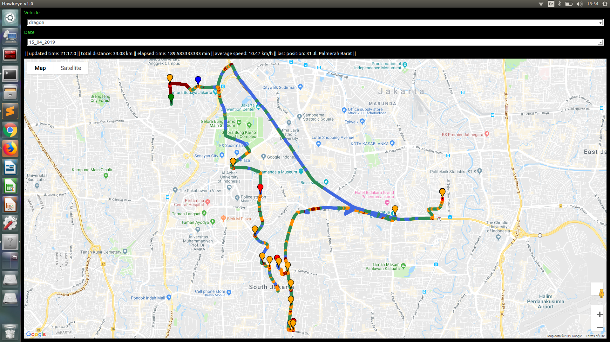
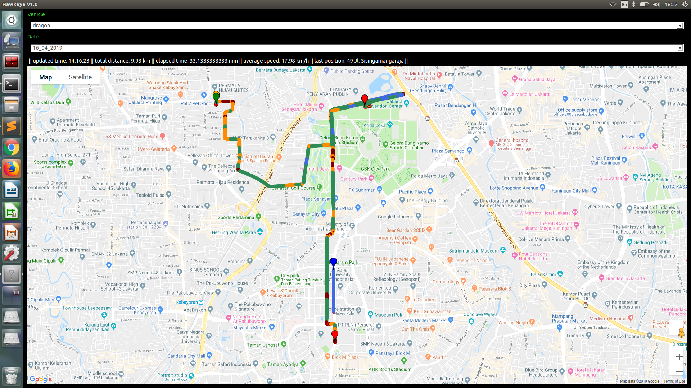
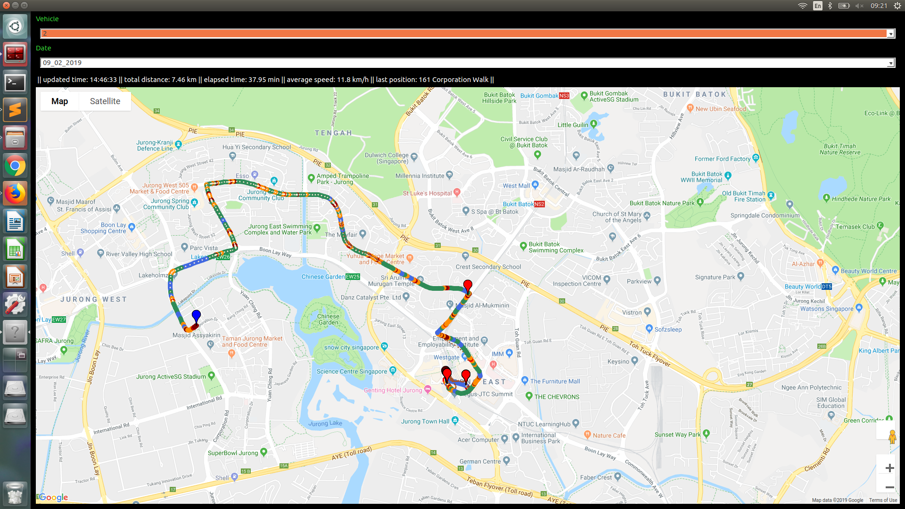
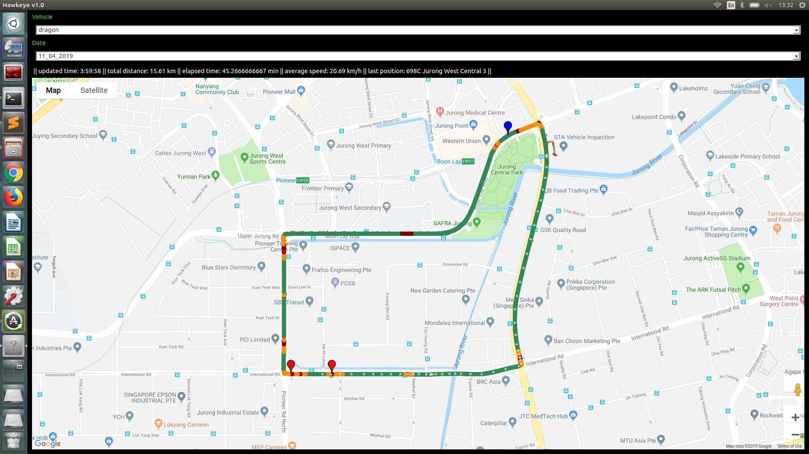

# HAWKEYE
Realtime Fleet Tracking System
_______________________________________________________________________
reinaldomaslim

Nodes:
1. AWS Server
2. Station Machine
3. Rpi3 Client
4. Android Client

Instructions:
On Station Machine
1. clone repo
2. run setup.sh
3. launch ./run_station.sh

On Android Client
1. download GPSLogger app
2. set unique id name e.g. 'dragon'
3. setup file naming conventions #NAME_#DAY#MONTH#YEAR_#HOUR.geojson
3. setup logging to every 5s
4. setup comms via sftp, load server address and private ssh key into phone

On Rpi3 Client
1. clone repo to ubuntu mate os
2. run setup.sh
3. check gps and internet connections
4. set unique id name e.g. 'falcon' in config.py
5. setup run on startup to ./run_client.sh

Notes:
1. Android phones must not use power saving mode
2. Rpi3 client need 5V w sufficient current (1-2A)
3. Path colors coding: red-very slow, green-average, blue-fast
4. Flags: green-starting point, blue-last position, orange-short stops, red-long stops
_______________________________________________________________________